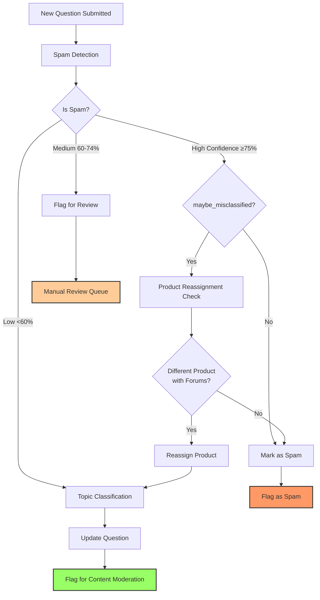
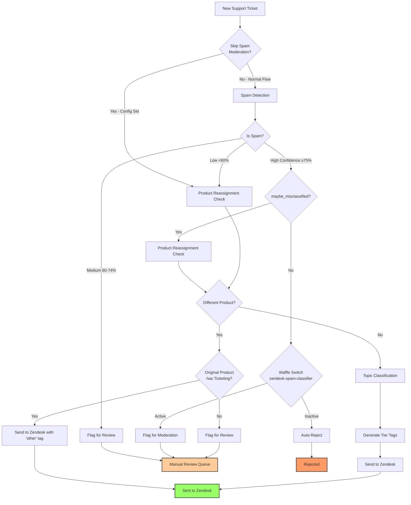

# AI-Powered Content Classification System

## Overview

Kitsune's AI-powered classification system automatically analyzes user-submitted content (support questions and Zendesk tickets) to detect spam, validate product assignment, and classify content into appropriate topics. The system uses Large Language Models (LLMs) to provide three-stage classification that helps route content correctly and reduce moderation burden.

## Classification Stages

The classifier performs up to three sequential analyses:

1. **Spam Detection** - Identifies spam, scams, and inappropriate content
2. **Product Validation** - Checks if content belongs to the correct product (with potential reassignment)
3. **Topic Classification** - Categorizes content into the product's taxonomy

## Architecture

### Core Components

#### 1. Spam Classifier (`kitsune/llm/spam/classifier.py`)

The spam classifier analyzes content and returns a confidence score (0-100) along with reasoning.

**Confidence Thresholds:**
- **≥75%**: High confidence spam → Automatic spam action
- **60-74%**: Medium confidence → Flag for manual review
- **<60%**: Low confidence → Not spam, continue to product/topic classification

**Special Flag - `maybe_misclassified`:**
When the LLM detects spam but suspects it might be legitimate content posted to the wrong product, it sets this flag. This triggers a product reassignment check before marking as spam.

#### 2. Product Classifier (`kitsune/llm/categorization/classifiers.py`)

Analyzes whether content belongs to a different product than initially assigned. This handles cases where users:
- Select the wrong product in the form
- Post content about multiple products
- Submit generic questions that better fit another product

The classifier can be configured to only consider products with forum support (`only_with_forums=True`).

#### 3. Topic Classifier (`kitsune/llm/categorization/classifiers.py`)

Classifies content into the product's topic taxonomy. Topics are hierarchical (e.g., "Sync and Save > Sync Your Profile") and used for:
- Routing to appropriate support channels
- Generating analytics
- Creating searchable tags (Zendesk)

### Entry Points

The classifier has two main entry points with different behaviors:

1. **`classify_question()`** - For support questions (AAQ flow)
2. **`classify_zendesk_submission()`** - For Zendesk support tickets

## Classification Flows

### Questions (AAQ) Flow



**Key Characteristics:**
- **Only considers products with forums** for reassignment (Questions require forum support)
- Updates question's product and topic fields if reassigned/classified
- Creates automatic tags based on topic
- All questions get flagged for content moderation with classification results

### Zendesk Flow



**Key Characteristics:**
- **Considers all products** for reassignment (not just those with forums)
- Can skip spam detection entirely via product configuration
- Special handling for product reassignment based on ticketing support
- Generates hierarchical tier tags (t1-, t2-, t3-) for Zendesk routing
- Waffle switch controls spam moderation vs auto-rejection

## Product Reassignment Logic

### Questions (AAQ)

When spam is flagged with `maybe_misclassified=True`:

1. Run product classifier with `only_with_forums=True`
2. If different product found with forum support:
   - Change action to `NOT_SPAM`
   - Reassign question to new product
   - Run topic classification for new product
3. If no suitable product found:
   - Keep spam classification

**Why only products with forums?** Questions require a forum for discussion, so reassignment only makes sense to products that support this channel.

### Zendesk

Product reassignment can happen in two scenarios:

**Scenario 1: Spam with `maybe_misclassified=True`**
- Check all products (not just those with forums)
- Decision based on original product's ticketing support:
  - **Original has ticketing**: Send to Zendesk with "other" tag (let Zendesk handle routing)
  - **Original lacks ticketing**: Flag for manual review (might need forum-based support)

**Scenario 2: Not spam, routine check**
- Check all products for better match
- Decision logic same as Scenario 1

**Why check ticketing support?** If the original product has Zendesk integration, a misclassified product can still be routed within Zendesk using the "other" tag. If the original product lacks ticketing, the user might need forum-based support instead, requiring human review.

## Zendesk Tag Generation

When a Zendesk ticket is classified as `NOT_SPAM`, the system generates tags for routing:

### Tier Tags

Topics are hierarchical. Example: `Sync and Save > Sync Your Profile > Sync Your Passwords`

This generates tier tags:
- `t1-sync-and-save`
- `t2-sync-your-profile`
- `t3-sync-your-passwords`

### Additional Tags

- **Legacy tags**: Backward-compatible tags for existing Zendesk workflows (e.g., "general", "bookmarks")
- **Automation tags**: Trigger specific Zendesk automations based on topic
- **"other" tag**: Added when product reassignment occurred
- **"undefined" tag**: Used when topic classification fails or returns "Undefined"
- **System tags**: Preserved tags like "loginless_ticket", "stage"

### Tag Conversion Rules

Topics → Tags transformation:
- Convert to lowercase
- Remove punctuation (`,` `.`)
- Replace spaces with hyphens
- Example: `"Sync and Save"` → `"sync-and-save"`

## Configuration

### Feature Flags (Waffle Switches)

**`auto-question-classifier`** (Questions)
- **Active**: Run full classification pipeline
- **Inactive**: Flag all questions for manual review (with `flagit-spam-autoflag` as fallback)

**`flagit-spam-autoflag`** (Questions)
- **Active**: Auto-flag questions when `auto-question-classifier` is disabled
- Only used as fallback mechanism

**`zendesk-spam-classifier`** (Zendesk)
- **Active**: Spam tickets go to moderation queue for human review
- **Inactive**: Spam tickets are automatically rejected (fully automated)

### Product-Level Configuration

#### Skip Spam Moderation

Products can bypass spam detection entirely via `ProductSupportConfig.zendesk_config.skip_spam_moderation`:

```python
config = product.support_configs.get(is_active=True)
if config.zendesk_config.skip_spam_moderation:
    # Skip spam detection, go straight to product/topic classification
```

**Use case**: High-trust products or products with external spam filtering.

#### Ticketing Support

Products declare Zendesk integration via `Product.has_ticketing_support`:

```python
@property
def has_ticketing_support(self):
    return self.support_configs.filter(
        is_active=True,
        zendesk_config__isnull=False,
    ).exists()
```

This property influences product reassignment behavior in Zendesk flow.

### LLM Configuration

The classifier uses the default LLM configured in `kitsune/llm/utils.py` via `get_llm()`. Model selection happens at runtime and can be configured via Django settings.

**Retry Logic**: All classifier chains use automatic retry with exponential backoff (via `build_chain_with_retry()`).

## Processing Pipeline

### Celery Tasks

**`question_classifier`** (`kitsune/llm/tasks.py`)
- Triggered when new question is created
- Checks `auto-question-classifier` waffle switch
- Calls `classify_question()` and `process_classification_result()`
- Retries on failure (max 3 retries with exponential backoff)

**`zendesk_submission_classifier`** (`kitsune/customercare/tasks.py`)
- Triggered when new support ticket is created
- Always runs (waffle switch only affects spam handling)
- Calls `classify_zendesk_submission()` and `process_zendesk_classification_result()`
- On failure after retries: marks ticket as `STATUS_PROCESSING_FAILED`

**`process_moderation_queue`** (`kitsune/llm/tasks.py`)
- Periodic task to reprocess flagged questions
- Only runs if `auto-question-classifier` is active
- Handles stale flags from previous classification attempts

**`process_failed_zendesk_tickets`** (`kitsune/customercare/tasks.py`)
- Safety net for tickets where classification failed
- Sends to Zendesk with whatever tags are currently set

**`auto_reject_old_zendesk_spam`** (`kitsune/customercare/tasks.py`)
- Auto-rejects spam tickets older than 14 days
- Prevents spam from accumulating in moderation queue

## Moderation Actions

The classifier returns one of three actions:

### ModerationAction.NOT_SPAM
- Content is legitimate
- Product/topic fields updated if needed
- Question: Flagged for content moderation with classification notes
- Zendesk: Sent to Zendesk with generated tags

### ModerationAction.SPAM
- High confidence spam (≥75%)
- Question: `mark_as_spam()` called, flagged as spam
- Zendesk: Behavior depends on `zendesk-spam-classifier` switch
  - Active: Flag for manual review
  - Inactive: Auto-reject (`STATUS_REJECTED`)

### ModerationAction.FLAG_REVIEW
- Medium confidence spam (60-74%)
- Both: Flagged with `FLAG_PENDING` status for manual review
- Includes LLM reasoning in flag notes

## Implementation Details

### Spam Detection with Confidence

The spam classifier returns structured output:

```python
{
    "is_spam": bool,
    "confidence": int,  # 0-100
    "reason": str,
    "maybe_misclassified": bool  # Optional flag
}
```

**Confidence determines action:**
```python
def determine_action_from_spam_result(spam_result: dict):
    confidence = spam_result.get("confidence", 0)
    if confidence >= 75:
        return ModerationAction.SPAM
    elif confidence > 60:
        return ModerationAction.FLAG_REVIEW
    else:
        return ModerationAction.NOT_SPAM
```

### Product Reassignment Helper

Both flows use a shared helper `_handle_product_reassignment()`:

```python
def _handle_product_reassignment(
    payload: dict[str, Any],
    product: Product,
    only_with_forums: bool,
    on_reassignment: Callable[[dict[str, Any], Product], dict[str, Any]],
) -> dict[str, Any] | None
```

This encapsulates:
1. Running product classifier
2. Checking if product actually changed
3. Calling the appropriate reassignment handler
4. Returning results or None if no reassignment

### Topic Hierarchy Handling

Topic classification may return hierarchical paths like:
- `"Sync and Save > Sync Your Profile"`
- `"Bookmarks.History.Cookies"`
- `"Privacy / Security :: Passwords"`

The system extracts the most specific topic using `get_most_specific()`:

```python
# Recognizes separators: ">", ";", " / ", " - ", ".", "::", ":", "|"
get_most_specific("Sync and Save > Sync Your Profile")
# Returns: "Sync Your Profile"
```

## Exception Handling

### Classification Failures

**Questions:**
- Task retries up to 3 times with exponential backoff
- If all retries fail: question remains unflagged (may be picked up by periodic queue processor)

**Zendesk:**
- Task retries up to 3 times
- After all retries: ticket marked `STATUS_PROCESSING_FAILED`
- Periodic task `process_failed_zendesk_tickets` sends these to Zendesk with current tags

### Missing Topics

If topic classification returns "Undefined" or topic isn't found in database:
- Question: Uses product's default topic (if any)
- Zendesk: Uses "undefined" + "general" tags

### Product Not Found

If product reassignment suggests a product that doesn't exist in the database:
- Reassignment is skipped
- Original product is retained
- Classification continues with original product's taxonomy

## Common Scenarios

### Scenario 1: Clean Question Submission
1. User submits Firefox question about bookmarks
2. Spam classifier: 15% confidence → `NOT_SPAM`
3. Product classifier: Confirms Firefox (no reassignment)
4. Topic classifier: "Bookmarks, History and Tabs > Bookmarks"
5. Question updated with topic, flagged for content moderation

### Scenario 2: Wrong Product Selection
1. User submits about "Pocket" but selected "Firefox"
2. Spam classifier: 20% confidence → `NOT_SPAM`
3. Product classifier: Detects "Pocket" product
4. Question reassigned to Pocket
5. Topic classifier runs with Pocket's taxonomy
6. Question updated, flagged for content moderation

### Scenario 3: Misclassified Spam (Question)
1. User posts legitimate Mozilla Account question
2. Spam classifier: 80% confidence, `maybe_misclassified=True`
3. Product reassignment check: Finds "Mozilla Account" product (has forums)
4. Action changed to `NOT_SPAM`, question reassigned
5. Topic classification runs for Mozilla Account
6. Question updated, flagged for content moderation

### Scenario 4: Misclassified Spam (Zendesk, Original Product Has Ticketing)
1. User submits VPN question to wrong product
2. Spam classifier: 85% confidence, `maybe_misclassified=True`
3. Product reassignment check: Finds "Mozilla VPN" product
4. Original product has ticketing support
5. Send to Zendesk with "other" tag (Zendesk will route)
6. No topic classification needed

### Scenario 5: Misclassified Spam (Zendesk, Original Product Lacks Ticketing)
1. User submits question to product without Zendesk integration
2. Spam classifier: 85% confidence, `maybe_misclassified=True`
3. Product reassignment check: Finds different product
4. Original product lacks ticketing support
5. Action: `FLAG_REVIEW` (might need forum support)
6. Human review required

### Scenario 6: Skip Spam for Trusted Product
1. Product configured with `skip_spam_moderation=True`
2. Spam detection bypassed entirely
3. Product reassignment check runs
4. Topic classification runs
5. Ticket sent to Zendesk with tags

### Scenario 7: High Confidence Spam (Zendesk, Auto-reject)
1. Obvious spam submitted
2. Spam classifier: 95% confidence
3. `zendesk-spam-classifier` switch inactive
4. Ticket auto-rejected (`STATUS_REJECTED`)
5. No flagged object created

### Scenario 8: Medium Confidence Spam
1. Suspicious content submitted
2. Spam classifier: 65% confidence
3. Action: `FLAG_REVIEW`
4. Question/ticket flagged with `FLAG_PENDING`
5. Waits in moderation queue for human review

## Summary of Key Differences

| Aspect | Questions (AAQ) | Zendesk |
|--------|----------------|---------|
| **Product Reassignment Scope** | Only products with forums | All products |
| **Reassignment Decision Factor** | N/A (forums required) | Original product's ticketing support |
| **Spam Moderation Bypass** | Not available | Via `skip_spam_moderation` config |
| **Spam Handling Switch** | `auto-question-classifier` | `zendesk-spam-classifier` |
| **Tag Generation** | Auto-tags based on topic | Hierarchical tier tags (t1-, t2-, t3-) |
| **Failed Classification** | Silent failure (retry later) | Marked failed, sent without full classification |
| **Output** | Updated Question record + FlaggedObject | Zendesk ticket with tags |

## Monitoring and Observability

### FlaggedObject Records

All classification results create `FlaggedObject` records with:
- **Reason**: `REASON_SPAM` or `REASON_CONTENT_MODERATION`
- **Status**: `FLAG_PENDING` or `FLAG_ACCEPTED`
- **Notes**: LLM reasoning and classification details
- **Creator**: SUMO Bot user

### Status Tracking (Zendesk)

Support tickets progress through statuses:
- `STATUS_NEW` → Created
- `STATUS_PROCESSING_FAILED` → Classification failed
- `STATUS_FLAGGED` → Awaiting moderation
- `STATUS_SENT` → Sent to Zendesk
- `STATUS_REJECTED` → Rejected as spam

### Logging

Classification tasks log to `k.task` logger with:
- Classification failures and retry attempts
- Failed ticket processing counts
- Auto-rejection counts for old spam