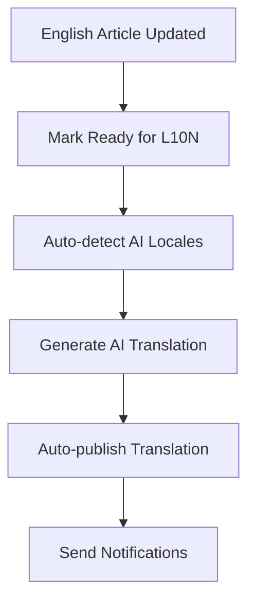
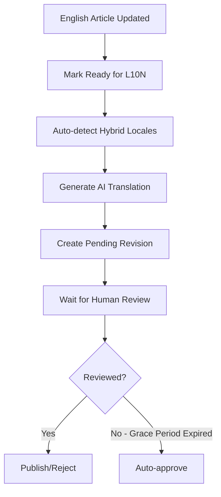
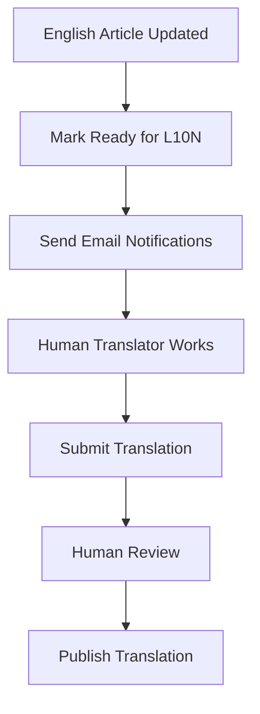

# AI-Powered Localization (l10n) System

## Overview

Kitsune's AI-powered localization system automates the translation of knowledge base articles from English to multiple target languages using Large Language Models (LLMs). The system supports multiple translation strategies and workflows to accommodate different locales and quality requirements.

## Architecture

### Core Components

#### 1. Translation Strategies (`kitsune/wiki/strategies.py`)

The l10n system implements a strategy pattern with three main translation approaches:

**ManualTranslationStrategy**
- Traditional human-only translation workflow
- Handles marking content as "ready for localization"
- Sends notifications to translators via email
- Used for locales without AI support

**AITranslationStrategy**
- Fully automated AI translation
- Translates content automatically using LLMs
- Auto-publishes translations without human review
- Used for locales in `AI_ENABLED_LOCALES` setting

**HybridTranslationStrategy**
- AI translation with human review
- Creates AI translations but requires human approval
- Includes grace period for review before auto-approval
- Used for locales in `HYBRID_ENABLED_LOCALES` setting

#### 2. LLM Translation Engine (`kitsune/llm/l10n/translator.py`)

The core translation function uses LangChain to orchestrate LLM calls:

```python
def translate(doc: "Document", target_locale: str) -> dict[str, dict[str, Any]]:
    """
    Translates summary, keywords, content, and conditionally title
    """
```

Key features:
- Uses Gemini 2.5 Pro model by default (`L10N_LLM_MODEL`)
- Supports incremental translation by comparing with prior versions
- Preserves special wiki markup and protected terms
- Returns both translation and explanation for each field

#### 3. Translation Prompts (`kitsune/llm/l10n/prompt.py`)

Sophisticated prompt engineering ensures high-quality translations:

- **Protected Terms**: Preserves Mozilla product names and special markup (`L10N_PROTECTED_TERMS`)
- **Wiki Syntax Preservation**: Maintains links, images, templates, and formatting
- **Incremental Translation**: Reuses previous translations for unchanged content
- **Context Awareness**: Understands technical documentation context

#### 4. Content Managers (`kitsune/wiki/content_managers.py`)

Different content managers handle the publishing workflow:

- `ManualContentManager`: Human-driven workflow
- `AIContentManager`: Automated publishing
- `HybridContentManager`: Mixed human/AI workflow

#### 5. Services (`kitsune/wiki/services.py`)

**TranslationQueryBuilder**
- Centralized repository for complex translation discovery queries
- Provides methods to find stale and missing translations
- Implements document-aware routing logic for AI vs HYBRID flows
- Key methods:
  - `get_stale_docs_hybrid()`: Finds non-archived stale translations in HYBRID locales
  - `get_stale_docs_ai()`: Finds all stale translations for AI flow (all AI docs + archived HYBRID docs)
  - `get_missing_docs_hybrid()`: Finds non-archived documents without translations in HYBRID locales
  - `get_missing_docs_ai()`: Finds documents without translations for AI flow
  - `get_pending_translations()`: Finds unreviewed translations exceeding grace period
  - `get_obsolete_translations()`: Finds translations that are no longer useful

**BaseTranslationService**
- Shared processing logic for translation services
- Handles metadata building and strategy execution
- Uses TranslationQueryBuilder for document discovery

**StaleTranslationService**
- Identifies outdated translations that need updates
- Processes batch updates using appropriate strategies
- Configurable via `STALE_TRANSLATION_THRESHOLD_DAYS` and `STALE_TRANSLATION_BATCH_SIZE`
- Method: `process_stale(limit, strategy)` - optionally filters by AI or HYBRID strategy

**MissingTranslationService**
- Creates initial translations for documents without existing translations
- Uses document archive status for smart routing
- Method: `process_missing(limit, strategy)` - creates translations for missing docs

**HybridTranslationService**
- Manages hybrid workflow automation
- Auto-approves translations after grace period (`HYBRID_REVIEW_GRACE_PERIOD`)
- Rejects obsolete machine translations

### Translation Triggers

The system responds to several trigger events (`TranslationTrigger`):

- `REVIEW_REVISION`: When a revision is approved and marked as ready for translation
- `MARK_READY_FOR_L10N`: Manual request to mark content for translation
- `TRANSLATE`: Direct translation request
- `STALE_TRANSLATION_UPDATE`: Periodic updates of outdated content
- `INITIAL_TRANSLATION`: Creating new translations for documents without existing translations

### Document-Aware Routing

The system intelligently routes translations based on document status and target locale:

**Archived Documents in HYBRID Locales**
- Archived knowledge base articles in HYBRID locales automatically use the AI flow
- This reduces review burden for content that's no longer actively maintained
- Implemented via `TranslationStrategyFactory.get_method_for_document()`

**Routing Logic:**
```python
if locale in HYBRID_ENABLED_LOCALES and document.is_archived:
    return TranslationMethod.AI  # Skip human review for archived docs
else:
    return get_method_for_locale(locale)  # Standard locale-based routing
```

## Configuration

### Settings

Key configuration settings control l10n behavior:

```python
# Locales using different strategies
AI_ENABLED_LOCALES = ['de', 'fr', 'es']  # Example
HYBRID_ENABLED_LOCALES = ['it', 'pt-BR']  # Example

# Stale translation detection
STALE_TRANSLATION_THRESHOLD_DAYS = 30
STALE_TRANSLATION_BATCH_SIZE = 50

# Hybrid workflow settings
HYBRID_REVIEW_GRACE_PERIOD = 72  # hours
```

### Protected Terms (`kitsune/llm/l10n/config.py`)

The system preserves Mozilla-specific terms and technical markup:

```python
L10N_PROTECTED_TERMS = [
    "Firefox", "Mozilla", "Thunderbird", "ESR",
    "Firefox Beta", "Firefox Nightly",
    # ... many more
]
```

## Workflows

### 1. AI Translation Workflow



### 2. Hybrid Translation Workflow



### 3. Manual Translation Workflow



## Management Commands

### Process Stale Translations

```bash
python manage.py process_stale_translations --limit 100
```

Updates outdated translations across all AI/Hybrid enabled locales. The service automatically routes documents based on their archive status and locale configuration.

### Create Missing Translations

```bash
python manage.py create_missing_translations --limit 50
```

Creates initial translations for English documents that don't have translations yet. Uses document-aware routing:
- AI locales: translates all documents (archived and non-archived)
- HYBRID locales (non-archived docs): creates translations for human review
- HYBRID locales (archived docs): auto-publishes via AI flow

### Publish Pending Translations

```bash
python manage.py publish_pending_translations
```

Auto-approves hybrid translations that have exceeded the review grace period.

### Update L10N Metrics

```bash
python manage.py update_l10n_metric
python manage.py update_l10n_coverage_metrics
python manage.py update_l10n_contributor_metrics
```

Updates various localization metrics for dashboards and reporting.

### Report L10N Metrics

```bash
python manage.py report_l10_metrics
```

Generates a comprehensive report showing localization coverage across core locales, most-requested locales, and individual locales. Shows both availability percentages and up-to-date status for all localizable knowledge base articles.

## Key Data Structures

### TranslationRequest

```python
@dataclass
class TranslationRequest:
    revision: Revision
    trigger: TranslationTrigger
    target_locale: str = ""
    method: TranslationMethod = TranslationMethod.MANUAL
    asynchronous: bool = False
```

### Usage Example

```python
from kitsune.wiki.strategies import TranslationStrategyFactory

factory = TranslationStrategyFactory()
request = TranslationRequest(revision=rev, target_locale='de', method=TranslationMethod.AI)
result = factory.execute(request)
```