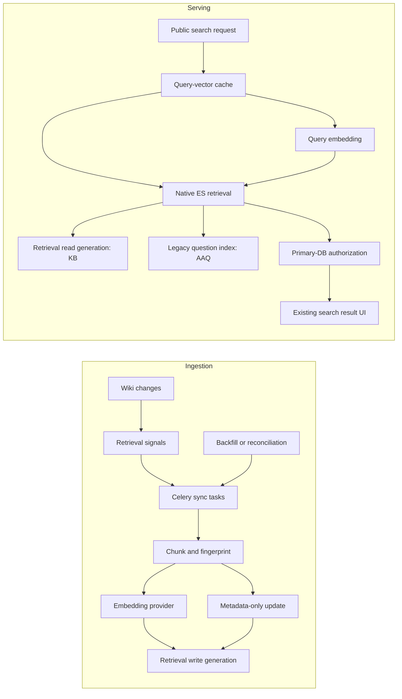

# Retrieval and hybrid search

Kitsune's retrieval application provides a reusable retrieval layer for semantic search and
future RAG consumers. It chunks approved knowledge-base (KB) documents, creates embeddings in
the application, stores chunks and vectors in Elasticsearch, and exposes an authorized hybrid
reader.

It runs alongside the [legacy Elasticsearch integration](elastic_search.md):

- KB results come from the retrieval chunk index and can match lexically and semantically.
- Ask a Question (AAQ) results still come from the existing question index and match lexically.
- Elasticsearch's native reciprocal rank fusion (RRF) combines the selected sources into one
  ranked list.
- With the `retrieval-hybrid-search` Waffle switch off, public search continues to use the
  legacy search path unchanged.

The current retrieval corpus contains public KB documents only. The schema and reader model
group access, but restricted content must not be embedded or indexed until
[ADR 0006](architecture/decisions/0006-access-controlled-retrieval.md) is accepted and its
policy prerequisites are met.

## Architecture



There are deliberately separate write and read generations. Ingestion always snapshots one
concrete write generation before doing work. Search resolves one concrete read generation and
uses the embedding recipe stamped on that generation. During a rebuild, writes move to the new
generation while reads stay on the old one until the new index is complete and passes its
integrity gate.

### Where the code lives

| Concern | Main modules |
| --- | --- |
| HTML chunking and show-for scope | `kitsune/retrieval/chunking.py` |
| Embedding recipes and provider calls | `kitsune/retrieval/embeddings.py` |
| Per-document hashes and index fingerprints | `kitsune/retrieval/fingerprints.py` |
| Elasticsearch mapping and physical I/O | `kitsune/retrieval/index.py` |
| Eligibility and access metadata | `kitsune/retrieval/eligibility.py` |
| Sync planning and execution | `kitsune/retrieval/sync.py` |
| Celery tasks and wiki triggers | `kitsune/retrieval/tasks.py`, `signals.py` |
| Index lifecycle and integrity | `retrieval_init`, `sync_chunks`, `gate.py` |
| Lexical, kNN, RRF, and response decoding | `kitsune/retrieval/query.py` |
| Authoritative access checks | `kitsune/retrieval/access.py` |
| Public-search orchestration | `kitsune/search/hybrid.py` |

## Ingestion model

### Chunks are the retrieval unit

One approved localized KB document becomes several `ChunkDocument` records. The chunker keeps
headings with their content, respects lists and tables, preserves nested show-for clauses, and
splits oversized text within the embedding model's input limit. Each chunk stores:

- `content_text` for lexical search and highlighting;
- `content_vector` for kNN semantic search;
- source identity, position, locale, and translation `family_id`;
- denormalized display and filtering metadata; and
- lossless show-for `scope` plus the cheaper, lossy `applies_to` projection.

`scope` describes where content applies. It is not authorization. `visibility` and
`access_group_ids` describe who may access a document.

The translation family is namespaced as `kb:<original-document-id>`. AAQ uses
`aaq:<question-id>`. Namespacing prevents unrelated content types with the same numeric ID from
collapsing into one result.

### A manifest is the commit marker

Every source identity also has one `kind=manifest` Elasticsearch document. It has no text or
vector. It records the expected chunk count, hashes, chunking generation, indexed revision, and
update time.

Replacement writes follow this order:

1. Write and verify the expected chunks.
2. Delete and verify obsolete positions.
3. Write the manifest last.

Elasticsearch bulk writes are not transactional. Writing the manifest last makes an interrupted
operation detectable: the integrity gate and the next sync can see that the stored layout is not
a complete committed document.

### Hashes choose the cheapest correct update

The worker computes two per-document hashes:

| Hash | Covers | Change means |
| --- | --- | --- |
| `content_hash` | Ordered text sent to the document embedder | Re-embed and replace chunks |
| `index_state_hash` | Chunk scope/headings and shared source metadata | Update metadata without paying to re-embed |

For an eligible document, synchronization chooses one outcome:

- missing manifest, changed content, or incomplete chunk layout: embed and replace;
- unchanged content with changed state or access metadata: metadata-only update;
- matching committed state: no-op;
- newer stored revision/generation: abort rather than overwrite it with stale work.

An ineligible or deleted document is evicted from the current write generation. Signals mean
"this document may have changed"; Elasticsearch state and freshly computed hashes decide whether
work is necessary. There is no retrieval dirty column in the wiki database.

### Index fingerprints protect vector compatibility

Each physical index stores readable configuration and digests in the mapping's `_meta` object:

- the document embedding fingerprint identifies the stored vector space;
- the query embedding fingerprint identifies how queries must be encoded; and
- the mapping fingerprint identifies vector mapping properties that require a new index.

This metadata is index-level, not repeated per chunk. It prevents a worker or query from silently
mixing incompatible models, dimensions, normalization, or vector mappings. A query-only recipe
change updates `_meta`; a document recipe or rebuild-requiring mapping change requires a new
physical index and a full backfill. Search analyzers and query-time synonyms are intentionally not
part of the vector fingerprint.

## Read path

The public-search integration maps the existing tabs to explicit sources:

| Search selection | Retrieval sources |
| --- | --- |
| Knowledge Base | KB chunk index |
| Community Support | Legacy AAQ index |
| All | Both indices |
| Discussions | Legacy search path |

For a request involving KB content:

1. Resolve the concrete retrieval read generation and its query recipe.
2. Look up an exact-query vector in Django's shared cache. The key contains hashes of the exact
   query text and query recipe, not user identity or retrieved content.
3. On a miss, apply the embedding rate limit and call the provider with the short interactive
   timeout. Provider or rate-limiter unavailability degrades to lexical retrieval.
4. Run one Elasticsearch request over the selected indices. KB contributes lexical and, when a
   query vector is available, semantic candidates; AAQ contributes lexical candidates.
5. Fuse multiple children with native RRF and collapse results by `family_id`.
6. Treat decoded KB hits as unvalidated candidates. Recheck current eligibility, product, locale,
   and viewer access in one bounded primary-database query before returning them.
7. Convert authorized evidence into the existing search result shape and templates.

The database check is the authorization boundary. Elasticsearch access filters reduce exposure
and preserve useful recall, but asynchronous index metadata is not authoritative. Code outside
`retrieval.access` must not return `_retrieve_unvalidated()` results to a user or place their text
in a prompt.

### Ranking and pagination limits

The first version intentionally uses bounded retrieval rather than an adaptive refill loop:

- lexical candidates are collapsed per family before fusion so one long KB article cannot
  monopolize the lexical ranks;
- semantic kNN still ranks chunks before top-level family collapse;
- a similarity-profile-specific floor lets semantic retrieval return no candidates rather than
  always returning the nearest unrelated chunks;
- RRF scores are used for ordering, not as a portable relevance threshold;
- authorization over-fetch absorbs some stale or inaccessible KB candidates, but a page may still
  be short;
- Elasticsearch's extra-result probe keeps Next available when more raw candidates exist; a later
  page that authorizes nothing redirects to page one rather than hiding reachable candidates; and
- pagination is Previous/Next within a fixed RRF window. Counts are approximate family
  cardinality, not an exact number of reachable pages.

These bounds and relevance settings must be calibrated with environment-appropriate evaluation
data before enabling the feature. Do not derive production thresholds from an old or different
environment's corpus.

## Flags and configuration

Three controls have different jobs:

| Control | Effect | Activation |
| --- | --- | --- |
| `RETRIEVAL_INGESTION_ENABLED` | Registers retrieval signal receivers | Process restart required |
| `RETRIEVAL_LIVE_INDEXING` | Allows signals and ordinary tasks to enqueue/run incremental sync | Settings deployment/restart |
| `retrieval-hybrid-search` Waffle switch | Sends supported public search requests through the hybrid reader | Runtime Waffle change |

Keep ingestion registration and live indexing off until the worker queues, provider credentials,
and target generation are ready. Manual backfill and reconciliation remain possible with live
indexing off because they pin tasks to an explicit physical index.

Important query controls include:

- `RETRIEVAL_QUERY_EMBEDDING_RATE`: `0/s` disables new query embeddings and safely uses lexical
  retrieval; a positive rate such as `10/m` enables bounded provider calls;
- `RETRIEVAL_QUERY_EMBEDDING_TIMEOUT_SECONDS`: the short interactive provider deadline;
- `RETRIEVAL_QUERY_VECTOR_CACHE_TTL_SECONDS`: lifetime of exact-query vectors;
- `RETRIEVAL_KNN_SIMILARITY_FLOORS`: JSON mapping from similarity-profile fingerprint to a
  calibrated cosine floor;
- `RETRIEVAL_SEMANTIC_K`, `RETRIEVAL_KNN_NUM_CANDIDATES`, and
  `RETRIEVAL_RRF_RANK_WINDOW_SIZE`: semantic and fusion work bounds; and
- `RETRIEVAL_AUTHORIZATION_OVERFETCH` and `RETRIEVAL_MAX_PAGE_OFFSET`: bounded authorization and
  pagination behavior.

Run Django's system checks after changing these settings. Retrieval checks enforce relationships
such as `num_candidates >= semantic_k`, the pagination window bound, valid floors, and:

```text
embedding request timeout < task soft limit < task hard limit < document lease TTL
```

That timing invariant is what prevents a fixed Redis document lease from expiring while its
worker can still write. Do not add a background lease heartbeat as a substitute for bounded
provider and task execution.

## First-time setup and backfill

Local and CI Elasticsearch must support native RRF. The Docker service uses the same Elasticsearch
version as stage and starts new data volumes with a trial license; see
[Licensed features in local development and CI](elastic_search.md#licensed-features-in-local-development-and-ci).

Stage and production use Elastic Cloud with an Enterprise license, so native RRF is available.
They currently do not provision Elasticsearch ML capacity because Kitsune computes embeddings
through its application-side provider. Elasticsearch ML nodes are therefore not a prerequisite
for this architecture; provisioning them remains an option for a future in-cluster reranker or
inference experiment.

With a configured embedding backend:

```bash
# Create and stamp the first write generation. It is not served yet.
./manage.py retrieval_init

# Use the concrete index name printed above.
./manage.py sync_chunks --backfill --index sumo_chunkdocument_<timestamp>

# After retrieval_bulk and retrieval workers have drained, verify completeness.
./manage.py sync_chunks --gate --index sumo_chunkdocument_<timestamp>

# The command runs the gate again and atomically moves the read alias.
./manage.py retrieval_init --migrate-reads
```

The Celery deployment must consume both `retrieval` and `retrieval_bulk`. `sync_chunks` enqueues
work and returns; it does not wait for the queues to drain.

Before enabling semantic queries, calibrate a similarity floor for that environment and bind it
to the active index's similarity profile. A missing or stale profile is a configuration error,
not permission to issue an unbounded kNN query. Configure a positive query embedding rate, then
enable the `retrieval-hybrid-search` Waffle switch. The deterministic `fake` backend is for local
development and tests, not relevance evaluation.

The following shell snippet prints the active index and the fingerprint used as the
`RETRIEVAL_KNN_SIMILARITY_FLOORS` key:

```bash
./manage.py shell -c '
from kitsune.retrieval.fingerprints import read_index_meta, similarity_profile_fingerprint
from kitsune.retrieval.index import resolve_read_target_and_recipe

index, _ = resolve_read_target_and_recipe()
print(index, similarity_profile_fingerprint(read_index_meta(index))[1])
'
```

The setting is a JSON object, for example
`{"<similarity-profile-fingerprint>": 0.72}`. The number is illustrative only: use the reviewed
value measured for that deployment's model and corpus. Enable the Waffle switch through the
Django admin only after the read alias, floor, rate limit, and serving checks are ready.

## One-off relevance evaluation

`evaluate_retrieval` freezes two environment-specific inputs before comparing retrieval
configurations. The positive artifact is derived from solved AAQ threads whose accepted answer
cites a KB article. The no-answer artifact is a small manually reviewed JSON list whose queries
have no useful result in the current corpus:

```json
[
  {"query": "printer catches fire", "locale": "en-US"},
  {"query": "fax machine sings", "locale": "en-US"}
]
```

The freeze command requires both deterministic splits to contain at least one query. Add more
reviewed examples if either tuning or holdout is empty; do not move queries between splits by
hand.

Create both artifacts while the Waffle switch remains off:

```bash
./manage.py evaluate_retrieval derive-positive \
  --environment production \
  --output /controlled/tmp/retrieval-positive.json

./manage.py evaluate_retrieval freeze-no-answer \
  --environment production \
  --input /controlled/tmp/reviewed-no-answer.json \
  --output /controlled/tmp/retrieval-no-answer.json
```

Each artifact records its environment, concrete read generation, derivation contract,
deterministic tuning/holdout split, and artifact digest. Evaluation refuses changed artifacts or
artifacts from another environment or read generation.

Run one explicit configuration at a time. This example uses illustrative values, not production
recommendations:

```bash
./manage.py evaluate_retrieval evaluate \
  --environment production \
  --positive /controlled/tmp/retrieval-positive.json \
  --no-answer /controlled/tmp/retrieval-no-answer.json \
  --split tuning \
  --similarity-floor 0.72 \
  --default-operator OR \
  --minimum-should-match '2<75%' \
  --locale-composition combined \
  --output /controlled/tmp/retrieval-tuning.json
```

The report compares current KB lexical search, the new KB lexical query, semantic-only KB
retrieval, and KB RRF at family level. It separately reports semantic and full-hybrid returns for
the reviewed no-answer set, mixed KB/AAQ source distribution, KB-label displacement, semantic
family concentration, and requested-locale versus English evidence. The source AAQ thread is
excluded from its own mixed result list, and unlabelled AAQ results are not scored as irrelevant.

To compare lexical rules, similarity floors, candidate bounds, or locale composition, rerun the
same tuning artifacts while changing only the intended argument. After choosing one
configuration, run it once against `--split holdout`; do not tune from the holdout output. Query
vectors are embedded in batches and reused across every mode within a run. This bypasses the HTTP
rate limiter by design and is a paid operator action. Output paths are creation-only: the command
refuses to overwrite an artifact or report. An interrupted or failed evaluation writes no partial
report, because incomplete results must not become activation evidence.

Stage and production must derive and evaluate their own artifacts. The old local dump is suitable
only for functional command smoke tests, never for relevance, threshold, latency, or activation
evidence. These files contain public user-authored query text and result identities: keep them in
an operator-controlled temporary location, never commit or upload them, and delete them after
recording the digests, selected configuration, aggregate metrics, and go/no-go decision.

## Routine operations

### Inspect or repair drift

```bash
# Read-only integrity report; exits non-zero when findings exist.
./manage.py sync_chunks --gate

# Show what reconciliation would enqueue.
./manage.py sync_chunks --reconcile --dry-run

# Enqueue repairs and evictions, then gate again after workers drain.
./manage.py sync_chunks --reconcile
./manage.py sync_chunks --gate
```

Use `--locale` repeatedly to narrow an investigation. Without `--index`, these commands snapshot
the current write target. Name a concrete index when operating on a rebuild generation.

### Change a query recipe

A query-task-only change does not alter stored document vectors:

```bash
./manage.py retrieval_init
./manage.py retrieval_init --update-query-recipe
```

The first command classifies the mismatch; the second explicitly updates the stable generation's
query metadata. Recalibrate and configure the similarity floor for the resulting profile before
serving semantic queries.

### Rebuild for a document recipe or vector mapping change

```bash
# Confirm retrieval_init classifies the change as rebuild-requiring.
./manage.py retrieval_init

# Explicitly authorize a new physical generation and move writes to it.
./manage.py retrieval_init --start-rebuild

# Populate the printed concrete generation, wait, repair if necessary, and promote.
./manage.py sync_chunks --backfill --index sumo_chunkdocument_<new-timestamp>
./manage.py sync_chunks --gate --index sumo_chunkdocument_<new-timestamp>
./manage.py retrieval_init --migrate-reads
```

All mutations target only the write generation. Reads remain self-consistent on the old
generation during the rebuild. The old physical generation is retained for rollback and is never
deleted automatically. A full rebuild re-embeds the corpus; there is no vector-copy workflow.

## Development and testing

The smallest useful test commands are:

```bash
# Fast chunking and pure behavior tests.
docker compose run --rm web ./manage.py test \
  kitsune.retrieval.tests.test_chunking --keepdb

# Retrieval suite, including Elasticsearch-backed tests.
docker compose run --rm -e TEST=True web ./manage.py test \
  kitsune.retrieval --keepdb

# Public-search integration.
docker compose run --rm -e TEST=True web ./manage.py test \
  kitsune.search.tests.test_hybrid kitsune.search.tests.test_views --keepdb
```

`TEST=True` makes newly indexed documents immediately visible to round-trip tests. The fake
embedding backend produces deterministic, finite vectors and prevents paid API calls. Tests that
exercise native RRF still require an active Elasticsearch trial or Enterprise license.

## Correctness and operational guardrails

- Never send restricted KB text to the provider or retrieval index under the current policy.
- Never treat indexed access fields as authoritative; all user-facing KB evidence goes through
  `retrieval.access.retrieve()` and its primary-database recheck.
- Keep show-for `scope` separate from access control. They answer different questions.
- Resolve aliases once and write/query a concrete physical generation. An alias can move during a
  slow embedding call.
- Preserve the manifest-last write order. The manifest is the only committed per-document state.
- Do not broaden `content_hash` with metadata. Doing so turns cheap metadata changes into paid
  embeddings; add metadata to `index_state_hash` instead.
- Do not put lexical analyzers or synonyms in the vector mapping fingerprint. Query-time synonym
  changes do not invalidate vectors.
- Bind query vectors, cache keys, and similarity floors to the read generation's recipe/profile.
- Keep provider retries inside the embedding adapter. Celery retries around paid calls can
  multiply spend.
- Ensure workers consume both retrieval queues before running backfill. Otherwise Redis accepts
  jobs that no worker processes.
- Treat gate findings as actionable integrity failures. Do not promote a partially populated or
  mismatched generation.
- Reject malformed Elasticsearch hits individually, mark the response degraded, and emit a
  bounded event without indexed payloads. Invalid response-level structure still fails the
  request.
- Do not log query text, chunk text, vectors, group identifiers, credentials, or provider error
  messages. Retrieval events use bounded identifiers, counts, timings, and error types.

## Deliberately deferred

The first release does not include AAQ vectors, a cross-encoder reranker, chatbot generation,
adaptive result refill, deep/cursor pagination, strict fragment-level revocation, or ingestion of
restricted KB documents. These are follow-up product and evaluation decisions, not missing hooks
that should be filled opportunistically while changing the current path.
